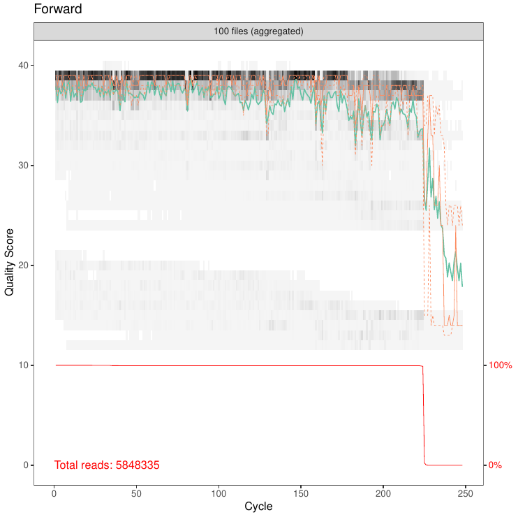
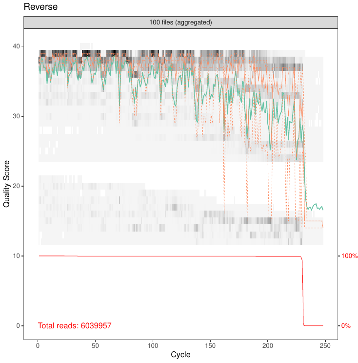

# DADA2 and Phyloseq pipelines

## Description
This pipeline has been written from the DADA2 script developped by [Francois Keck](https://github.com/fkeck/DADA2_diatoms_pipeline) and the files conversion for Phyloseq of the [ANF MetaBioDiv workshop](https://anf-metabiodiv.github.io/course-material/practicals/preprocessing_phyloseq.html).

It uses the [reference database manager for R](https://github.com/fkeck/refdb) to access the rbcL 312 database for DADA2, so no local database is needed. 

Other elements have been written from the official DADA2 documentation and [official tutorial](https://benjjneb.github.io/dada2/index.html). 

## Directories
The Dada2 and Phyloseq scripts are located in the ```scripts``` directory, and paths are set up to run them from this location. The raw sequencing reads should be stored in the ```data``` directory which should be imported with the ```scripts``` directories.
The pipeline will create a ```results``` and a ```plots``` directories to store the outputs.

If you are working with **RStudio**, the default working directory might not be the ```scripts``` directory, and might prevent the pipeline to work. The method to fix this problem is detailed in the *How to run the pipeline?* tutorial, point number 5.

## How to run the pipeline?

### 1. Download the scripts
The directories of the pipeline can be downloaded at the location of your choice using the **<> Code** button above, or on BASH using the command:

```
git clone git@github.com:ThibauldMichel/DADA2_Phyloseq.git
```

### 2. Install dependancies
The scripts will install R dependancies needed by the pipeline. However, a recent version of **cutadapt** is needed. Check the cutadapt website for [installation instructions](https://cutadapt.readthedocs.io/en/stable/installation.html). 

#### a. Windows operating system 

The path to the cutadapt executable should be provided between double quotes line 55 of the ```scripts/DADA2.R``` file as follow:

```
cutadapt <- "C:/path/to/cutadapt/executable" 
```

#### b. UNIX-based environment (Mac OS or Linux) 

The path of cutadapt should be provided as well. 

```
cutadapt <- "/path/to/cutadapt/executable" 
```

Alternatively, you may choose to put cutadapt in the $PATH. To do this, open the file ```bashrc``` with the following command:

```
gedit ~/.bashrc
```

Then paste the path to cutadapt as following.

```
export PATH=$PATH:/dir_containing_cutadapt
```

Then the script should run without modifications.


### 3. Set up primers removal
The Dada2 script incorporate a primer removal step from the [official DADA2 ITS Pipeline Workflow](https://benjjneb.github.io/dada2/ITS_workflow.html). 

The base set of primers used in the pipeline are designed to target a 312bp barcode located on a rbcL plastid gene described by from [Vasselon et al. 2017](https://www.sciencedirect.com/science/article/pii/S1470160X17303497?via%3Dihub).

If you are using another set of primers, replace the sequence forward (FWD) and reverse (REV) in the ```scripts/DADA2.R``` script lines 36 and 40.

Each primers sequences has to be between double quotes, and different primers has to be separated by a comma. In the base pipeline, three forward primers and two forwards are used as follow.

```
FWD <- c("AGGTGAAGTAAAAGGTTCWTACTTAAA",
         "AGGTGAAGTTAAAGGTTCWTAYTTAAA",
         "AGGTGAAACTAAAGGTTCWTACTTAAA")

REV <- c("CCTTCTAATTTACCWACWACTG",
         "CCTTCTAATTTACCWACAACAG")
```

### 4. Prepare the reads

In Next Generation Sequencing (NGS) data sets, two type of reads are provided in different files. Reads *forward*, labelled R1 and *reverse*, labelled R2. For each sample, both files R1 and R2 have to be put in the ```data``` directory in a compressed format, ending with ```fastq.gz```. 

```
{ID sample number}_L{Sequencing lane number}_R1_001.fastq.gz
{ID sample number}_L{Sequencing lane number}_R2_001.fastq.gz
```

### 5. Check the pipeline path

If you are working on **RStudio**, the woking directory path might not be located in the ```scripts``` directory as it is expected when simply running the R script out of RStudio. 

To be sure it is the case, go to the **RStudio** tab ```Session -> Set Working Directory -> To Source File Location``` and clic on this later option.

You can now check you are in the ```scripts``` directory with the command:

```
getwd()
```


### 6. Run the Quality Check (QC)
The pipeline can now be run through excecuting all the commands located in the **SET UP THE ENVIRONMENT**, **REMOVAL OF PRIMERS**, and **QC CHECK** steps. 

The pipeline will output graphs about the average error rate observed in the Forward and Reverse reads in the ```plots``` directory. 

<div style="display: flex; justify-content: center;">
    <div style="margin-right: 20px;">
        
    </div>
    <div style="margin-left: 20px;">
        
    </div>
</div>

<div style="text-align: center; margin-top: 20px;">
    <p>QC check of the reads Forward and Reverse.</p>
</div>

We will use the average QC check to estimate how to trim our reads. Look at the plot, and locate the Cycle score for which the quality start to drop for Forward and Reverse reads. 

In the exemple above the Quality Score drops at 220 for Forward reads, and 230 for Reverse reads.